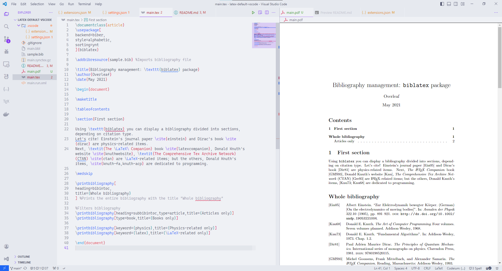

# Latex Default Vscode configs



## Use this repo as a template repo

With [gh-cli](https://cli.github.com/)
```bash
gh repo clone dinhanhx/latex-default-vscode folder-name
```

With git, 
```bash
git clone https://github.com/dinhanhx/latex-default-vscode.git folder-name
```

Don't forget to delete `.git` folder

## Recommended extension list

One can take a look at `.vscode/extensions.json`.

## Font and Theme

- 'Cascadia Code SemiLight' which can be installed from [Cascadia Code](https://github.com/microsoft/cascadia-code).
- 'Catppuccin Latte' with 'blue' which can be installed from [Catppuccin](https://github.com/catppuccin/catppuccin).

## Bibliography engines

By default, `.vscode/settings.json` uses biber and biblatex configs, which are hardcoded in `latex-workshop.latex.recipes`. If one wishes to change or revert to this default, try to update using one of the following configs.

### Biber and biblatex (default)

```json
{
    "name": "pdflatex ➞ biber ➞ pdflatex`×2",
    "tools": [
        "pdflatex",
        "biber",
        "pdflatex",
        "pdflatex"
    ]
},
{
    "name": "xelatex ➞ biber ➞ xelatex`×2",
    "tools": [
        "xelatex",
        "biber",
        "xelatex",
        "xelatex"
    ]
},
{
    "name": "lualatex ➞ biber ➞ lualatex`×2",
    "tools": [
        "lualatex",
        "biber",
        "lualatex",
        "lualatex"
    ]
}
```

### Natbib and bibtex

```json
{
    "name": "pdflatex ➞ bibtex ➞ pdflatex`×2",
    "tools": [
        "pdflatex",
        "bibtex",
        "pdflatex",
        "pdflatex"
    ]
},
{
    "name": "xelatex ➞ bibtex ➞ xelatex`×2",
    "tools": [
        "xelatex",
        "bibtex",
        "xelatex",
        "xelatex"
    ]
},
{
    "name": "lualatex ➞ bibtex ➞ lualatex`×2",
    "tools": [
        "lualatex",
        "bibtex",
        "lualatex",
        "lualatex"
    ]
}
```

## Latex packages

### TexLive 

There are `package_install.sh` (for Linux) and `package_install.bat` (for Windows). One can reinstall all packages.

### MikTex

TODO